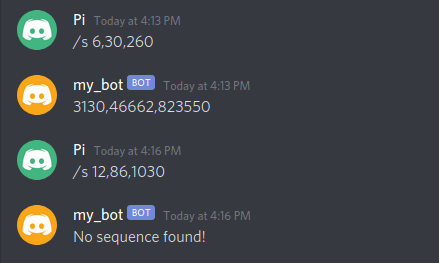

# discord-sequence-bot
A discord bot which completes the sequence provided by you! This uses the discord python apis and searches for sequences in the online integer sequences encyclopedia OEIS.

Edit1: Wow! I invited my friend to try this out, and while doing that, we discovered a new relatively simple sequence which is not in OEIS database. You can see my proposal to include it [here](https://oeis.org/draft/A338803).
